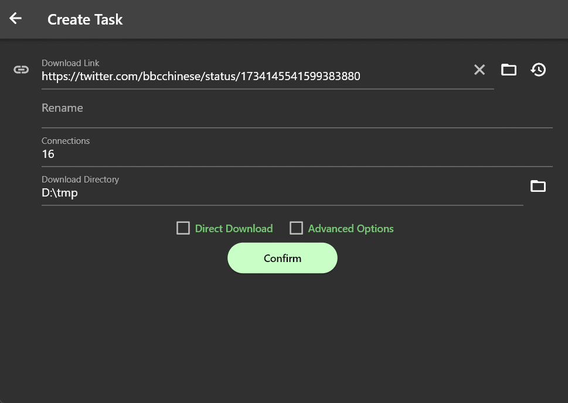

# Gopeed Twitter Extension

Twitter media download with [Gopeed](https://gopeed.com), support video, gif, image, etc.

## Install

Open the `Gopeed` extension page, enter `https://github.com/monkeyWie/gopeed-extension-twitter`, and click install.

## Usage

Create task with twitter status url, and click `Download` button, then the media will be resolved and ready to download.

## Useful Links

- [How to develop a gopeed extension](https://docs.gopeed.com/dev-extension.html)
